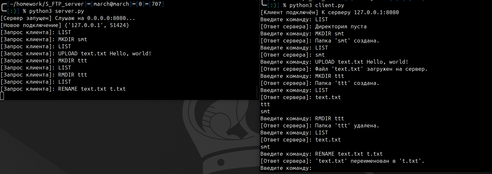
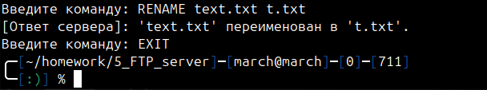
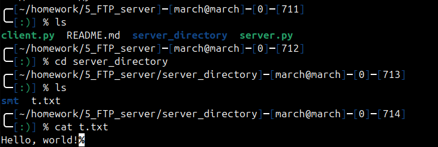

# Отчет по работе "FTP Server"

## Основное задание

Создать сервер, который предоставляет клиенту базовые возможности файлового менеджера по сети. Клиент после подключения к серверу должен иметь возможности просматривать список файлов и папок в рабочей директории сервера (рабочая директория - это специальная папка, к которой имеет доступ процесс сервера, но она отделена от парки с кодом сервера и от любых системных файлов), создавать и удалять в ней папки, создавать, копировать и переименовывать файлы. Также клиент может передать на сервер название и содержимое файла и сервер должен создать соответствующий файл в текущей директории. Кроме того, клиент может запросить содержимое любого файла и сервер должен передать его в ответ.
## Ход выполнения работы

Запустим сервер и клиент и проверим работу команд:

Посмотрим содержимое рабочей директории после отключения клиента:

